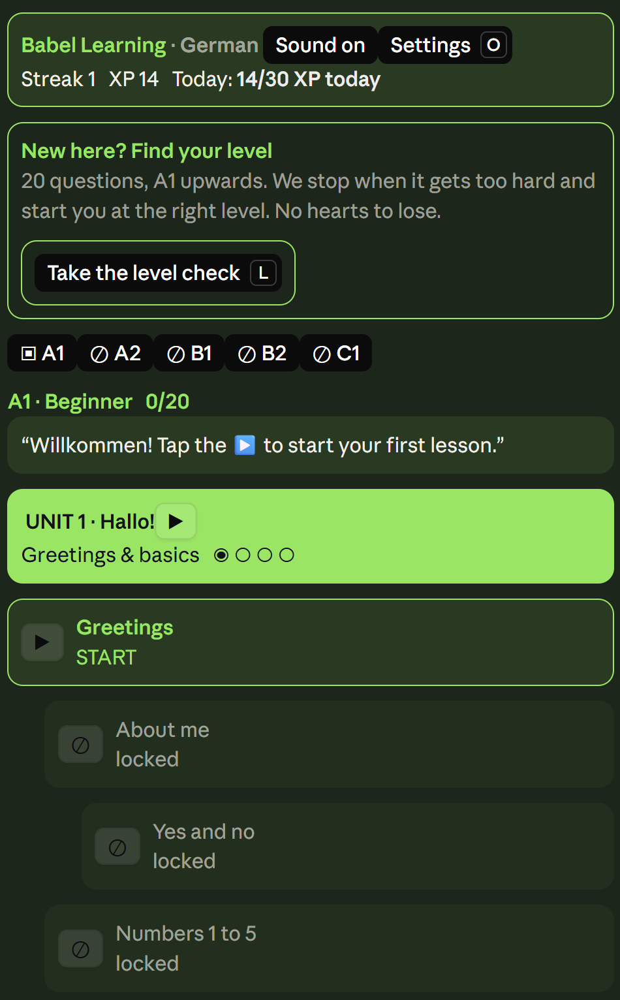
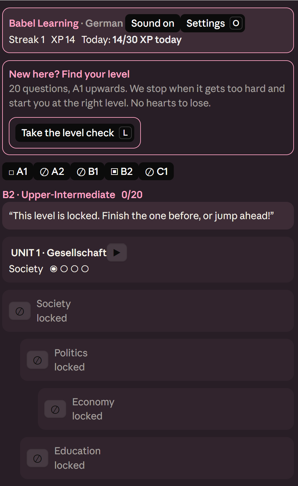
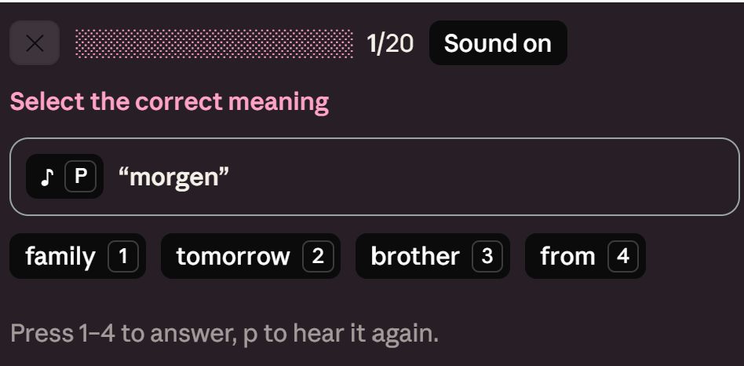

# Babel Learning: a Duolingo-style language course for Claude Code

Type `/babel-learning` in Claude Code (`/learn` also works). **German and French, A1 → C1**, 20 lessons per level (100 per language), with spoken audio, XP, hearts, streaks and a map of lessons that changes colour with your level.

It runs as a pane next to your conversation. It works in the Claude desktop app and in the terminal; the desktop pane gets the full design described below, and the terminal keeps a compact text version.

## Screenshots

<table>
  <tr>
    <td align="center"> A1: the map in lime</td>
    <td align="center"> B2: every level has its own colour</td>
    <td align="center"> A question: press 1 to 4, or p to hear it again</td>
  </tr>
</table>

## The map
- Five levels (A1 Beginner … C1 Advanced), each with **4 units × 5 lessons**: four lessons and a unit review.
- Each lesson is a card: a button, its title, and either `START`, its stars (1 to 3, by hearts left) or `locked`. Lessons unlock in order. A unit review closes every unit.
- **Level pills** (A1 … C1) at the top switch level. Locked levels are marked ⊘; open one to see its placement quiz.
- **Placement quiz:** know a level already? Pass 12 questions on the level below (two mistakes allowed) to unlock it.
- **Practice:** a 10-puzzle mix drawn from the lessons you have finished (flat 5 XP, no stars).
- **Words:** the words of your finished lessons, unit by unit, each with a play button.
- Header: **Streak**, **XP** and the daily goal (30 XP, shown as `Daily goal done ✓` or `12/30 XP today`). The header also holds the **Sound** toggle and the **Settings** button.

### One colour per level (desktop)
The desktop pane is dark, and every level has its own pastel colour: **A1 lime, A2 baby blue, B1 lilac, B2 bubblegum, C1 butter**. The colour sets the ground, the header outline, the unit banner, the current lesson and the highlights, so you can tell your level at a glance. Right answers are always green and wrong ones always red. The terminal keeps its own named colours.

## Level check and unlocking
New here? The map offers a **Level check** (hotkey **l**; it stays on the map for later). It asks 20 questions in five stages, four per level from A1 up. Get 3 of 4 right to move to the next level; it stops when a level is too hard. No hearts, no stars.

You land on the level after the last one you cleared. **Every lesson of the levels below it is unlocked and can be played in any order**; the level you land on starts at its first lesson. Passing a placement quiz does the same for the level it opens and the ones below. Stars you earn still show on each lesson.

## A lesson
1. **Intro:** the five new words, each with a play button, plus a grammar tip for the unit.
2. **11 to 14 puzzles**, ramping up as the unit goes on: select the meaning · how do you say it · tap the pairs · listen and choose · article (der/die/das) · spell it / spell what you hear · fill the gap · translate (pick) · translate (word bank, with decoys) · type what you hear · translate into English.
3. 5 hearts, combo bonus XP for streaks of correct answers, and the feedback banner cheers you on in the language you are learning (Super! Prima! Genau!).
4. Reordering a sentence's words costs no heart, because word order is often free; you just see the model answer.
5. A result card shows your stars, XP and best combo, and tells you when a unit or a whole level is complete.

## Settings
Press **Settings** in the header (hotkey **o**). It holds:
- **Language:** switch between German and French. Stars and unlocks are kept per course; XP, streak and the daily goal are shared.
- **Sound:** turn all audio on or off.
- **Audio test** (hotkey **a**): tries speech, a recorded clip and a beep, and shows the exact answer for each.

**← Map** (hotkey **m**) goes back.

## Keyboard
The pane opens focused, and it keeps the keyboard while you work. After each press or new question it puts the highlight on the next thing to press (the first answer of a question, the Continue button after you answer), so Enter and the hotkeys keep working without clicking the pane.

If the keys do nothing (you pressed Escape, or clicked back into the prompt), click the pane or press **ctrl+x** then **tab** to give it the keyboard again.

- **Up / Down / Tab** move the highlight between buttons, and **Enter** presses the highlighted one.
- **1–4** pick an option, **1–9** tap a word chip, **1–5** and **q–t** match pairs.
- **c** check or continue, **u** undo, **p** play the audio, **s** start, **n** next lesson, **r** try again.
- **x** practice, **w** words, **l** level check, **o** settings, **a** audio test, **m** back to the map.

## Audio
Every word and sentence is spoken.
- **macOS** uses the system voice (German **Anna**, French **Thomas**/**Amelie**).
- **Windows and Linux** have no speech synthesizer in Claude Code, so the app plays **recorded clips** that ship in `audio/<course>/` (about 560 per language, made with espeak-ng's MBROLA voices and ffmpeg: clear, but robotic, not a native speaker). On **Windows** the clips are played through the system media player (PowerShell), one at a time; clips that arrive while another is playing wait their turn.
- If neither works, the app shows the text instead.

To rebuild the clips after changing a course (needs `espeak-ng`, `mbrola` voices and `ffmpeg`): `npx tsx scripts/make-audio.ts` (only new words are made; `--check` lists words without a clip).

### Better voices with Azure Speech (optional)
`scripts/make-audio-azure.ts` makes the same clips with Azure Speech neural voices (German Katja, French Denise) in about 11 MB, with the same file names, so they can replace the espeak clips. It needs an Azure Speech resource (the free F0 tier is enough). Put the key and region in your environment, never in the repo:

    $env:AZURE_SPEECH_KEY = '...'
    $env:AZURE_SPEECH_REGION = 'westeurope'
    npx tsx scripts/make-audio-azure.ts --dry          # counts clips and characters, no key needed
    npx tsx scripts/make-audio-azure.ts --limit 20     # 20 clips into audio-azure/ to listen to first
    npx tsx scripts/make-audio-azure.ts                # every clip into audio-azure/

Listen with the **Audio test**, then copy `audio-azure/<code>/` over `audio/<code>/` and commit.

## Install (plug and play)

In Claude Code:

    /plugin marketplace add pseudometalhead/CCLanguageLearnerMod
    /plugin install language-learner@babel-learning

or from a terminal:

    claude plugin marketplace add pseudometalhead/CCLanguageLearnerMod
    claude plugin install language-learner@babel-learning

Then type `/babel-learning` (or `/learn`). To update:

    claude plugin marketplace update babel-learning
    claude plugin update language-learner@babel-learning

Restart Claude Code (or run `/reload-plugins`) to load the new version.

## Adding a language

The engine and the UI know nothing about German. Everything language-specific lives in one file per course:

1. Copy `hooks/courses/de.ts` to a new file (for example `hooks/courses/es.ts`) and fill in the `Course`: `code`, `name`, `flag` (kept for reference; the app shows the name, because Windows draws flag emoji as letters), the system `voices` for audio (macOS and Windows names, best first), the `article` rules (leave `article` out if the language has no gendered articles), `praise`, `coach` lines, and the 5 levels × 4 units × 4 lessons.
2. Register it in `hooks/courses/index.ts`.
3. `claude plugin test .` runs every content test against the new course automatically: no duplicate words, every gap sentence valid, every puzzle solvable, no leftover wording from another course.

Learners then get the new language in **Settings → Language**. `npx tsx scripts/lessons-md.ts > LESSONS.md` regenerates the table of lessons.

## Run from a checkout and test

    claude --plugin-dir /path/to/this/repo
    claude plugin validate .
    claude plugin test .

### Notes for contributors
- The desktop design lives in `hooks/register.tsx`: the `THEMES` table holds the five level colours, and the render hook adapts to `e.surface` (`desktop` or terminal).
- Desktop buttons are drawn by the app: white, or black when `variant="primary"`. They cannot be recoloured, so the design colours the boxes around them.
- On a desktop a toast takes the keyboard back to the prompt, so completion is shown on the result card instead.
- Focus debugging: set the `DIAG` constant in `hooks/register.tsx` to a file path and the pane writes a trace of presses, redraws and focus requests to it.
